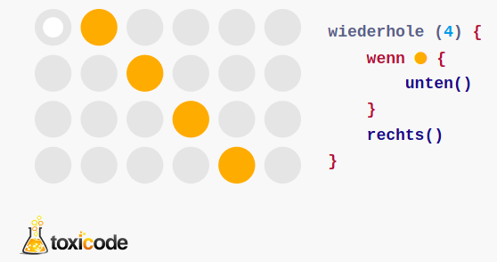

# Aufgabe 1:


Spielen Sie das toxicode-Spiel: https://compute-it.toxicode.fr/

# Text eingeben

hier einen beliebigen Text eingeben und mit STRG+EING anzeigen lassen

``` python
# Python Code eingeben und ausführen (auch mit STRG+EING)
print (2+2)
print (7*8)
print ("Text")
```

    4
    56
    Text

# Grafiken einfügen

Am einfachsten speichert man ein Bild oder ein Screenshot zwischen und
fügt man es mit `STRG+V` in eine **Textzelle (Markdown-Zelle)** ein.

<figure>

<figcaption aria-hidden="true">image.png</figcaption>
</figure>

# Aufgabe 2:

Fügen Sie hier eine beliebige Grafik als Screenshot ein.

# Struktogramme erzeugen

Eine toxicode-Aufgabe kann man als Struktogramm
(Nassi–Shneiderman-Diagramm) darstellen: \### toxicode-Aufgabe 1

\### Struktogramm 1


Öffnen Sie den online Struktogramm-Editor unter
https://ddi.education/struktog/ Zeichnen Sie die Struktogramme zu den
folgenden toxicode-Aufgaben, machen Sie ein Screenshot davon und fügen
Sie es hier ein. \### toxicode-Aufgabe 2


### Struktogramm 2

### toxicode-Aufgabe 3

<figure>

<figcaption aria-hidden="true">image.png</figcaption>
</figure>

### Struktogramm 3

### toxicode-Aufgabe 4

<figure>

<figcaption aria-hidden="true">image.png</figcaption>
</figure>

### Struktogramm 4
