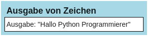

# Ausgabe von Zeichen mit print()


Oft werden Programme geschrieben, bei denen dem Benutzer Daten am
Bildschirm ausgegeben werden. In Python kann man dazu die Funktion
*print()* benutzen.

``` python
print("Hallo Python-Programmierer!")
```

    Hallo Python-Programmierer!

## Struktogramm zum Programm:

<figure>

<figcaption aria-hidden="true">image.png</figcaption>
</figure>

**Hinweise:**  
Die Funktion *print()* gibt das, was in ihren nachstehenden Klammern
steht, auf dem Bildschirm aus. Dabei ist es wichtig, dass Texte in
Anführungszeichen gesetzt werden, damit Python die Zeichen auch als Text
erkennt und nicht als Python- bzw. Programm-Elemente interpretiert.
