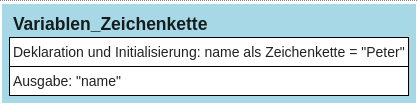

# Variable als Zeichenkette


Werte wie Zeichenketten, Zahlen oder Wahrheitswerte werden in Variablen
gespeichert. Variablen machen Programme leichter lesbar, weil durch die
Bezeichnung der Variablen deutlich wird, wofür die verschiedenen Werte
stehen. Zudem dienen Variablen dazu, Werte für spätere Operationen
verfügbar zu halten. Sie sind also ein Speicher für Werte, die man im
Laufe des Programms immer wieder benötigt. Möchte man eine Zeichenkette
in einer Variablen speichern, dann muss dafür ein Speicherplatz
geschaffen werden. Diesen Speicherplatz kann man sich wie eine Schublade
vorstellen. Außerdem braucht man einen Namen für die Variable, damit man
auf den Inhalt später wieder zugreifen kann. Im folgenden Beispiel wird
die Vorgehensweise erläutert:

``` python
# Beispiel für die Verwendung einer Variablen
name = "Peter"   # Deklaration und Initialisierung
print(name)      # Ausgabe der Variablen "name" auf dem Bildschirm
```

    Peter

Dieses kleine Python-Programm enthält zwei unterschiedliche Anweisungen.
Zu beachten ist, \* dass jede Anweisung in einer neuen Zeile steht, \*
dass eine Zeichenkette immer zwischen doppelten (oder einfachen)
Anführungsstrichen geschrieben wird, \* dass mit dem Zeichen „#“ ein
Kommentar zur Beschreibung der einzelnen Teile des Programms eingeleitet
wird. Kommentare werden nicht als Programmcode interpretiert.

## Struktogramm zum Programm:

<figure>

<figcaption aria-hidden="true">image.png</figcaption>
</figure>

### Namensregeln für Variablen:

-   Am Anfang sollte ein Kleinbuchstabe stehen. Ziffern sind nicht
    zulässig.
-   Danach dürfen Groß- und Kleinbuchstaben sowie Ziffern und
    Unterstriche verwendet werden.
-   Umlaute wie ä, ö, ü das ß, Leerzeichen und weitere Sonderzeichen
    sind nicht erlaubt.
-   Schlüsselwörter aus Programmiersprachen, z.B. for dürfen nicht
    verwendet werden.
-   Der Name sollte etwas über den Inhalt der Variablen aussagen. Dabei
    hat sich in Python als Standard ergeben, dass bei zusammengesetzten
    Wörtern die einzelnen Wörter durch einen Unterstrich getrennt
    werden, also z.B. *alter_in_jahren* oder *gewicht_in_kg*.

### Ausgabe mehrerer Variablen in einer Bildschirmausgabe

``` python
subjekt = "Ich"
praedikat = "spiele"
objekt = "Fußball"
print(subjekt, praedikat, objekt, "auf der Wiese.")
```
