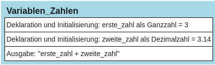

# Variable als Zahl


Möchte man Berechnungen durchführen, benötigt man Zahlen, die wiederum
in Variablen gespeichert werden können. Es können sowohl Ganzzahlen als
auch Dezimalzahlen verwendet werden.

``` python
# Beispiel:
erste_zahl = 3
zweite_zahl = 3.14
print(erste_zahl, zweite_zahl)
```

## Struktogramm:

<figure>

<figcaption aria-hidden="true">image.png</figcaption>
</figure>
