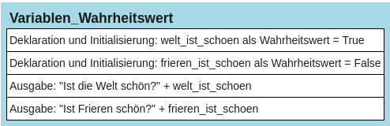

# Variable als Wahrheitswert


Neben der Zeichenkette und Zahlen können in Variablen auch
Wahrheitswerte vom Typ boolean gespeichert werden. Es gibt zwei
Wahrheitswerte: *True* und *False* (deutsch: wahr oder falsch).
Vorsicht: Groß- und Kleineinschreibung ist wichtig: Es muss genau True
und False heißen, true oder false wäre falsch!

``` python
# Beispiel:
welt_ist_schoen = True
frieren_ist_schoen = False
print("Ist die Welt schön?", welt_ist_schoen)
print("Ist Frieren schön?", frieren_ist_schoen)
```

## Struktogramm:

<figure>

<figcaption aria-hidden="true">image.png</figcaption>
</figure>
