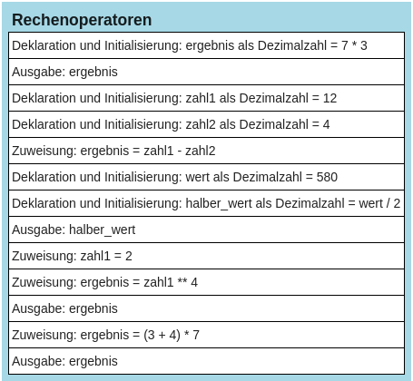

# Rechenoperatoren


Zur Durchführung von Berechnungen stehen verschiedene Rechenoperatoren
zur Verfügung:

<table>
<thead>
<tr class="header">
<th>Operator</th>
<th style="text-align: center;">Zeichen</th>
<th style="text-align: center;">Beispiel</th>
<th style="text-align: center;">Ergebnis</th>
</tr>
</thead>
<tbody>
<tr class="odd">
<td>Addition</td>
<td style="text-align: center;">+</td>
<td style="text-align: center;">3+4</td>
<td style="text-align: center;">7</td>
</tr>
<tr class="even">
<td>Substraktion</td>
<td style="text-align: center;">-</td>
<td style="text-align: center;">5-11</td>
<td style="text-align: center;">-6</td>
</tr>
<tr class="odd">
<td>Multiplikation</td>
<td style="text-align: center;">*</td>
<td style="text-align: center;">3*6</td>
<td style="text-align: center;">18</td>
</tr>
<tr class="even">
<td>Division</td>
<td style="text-align: center;">/</td>
<td style="text-align: center;">9/2</td>
<td style="text-align: center;">4.5</td>
</tr>
<tr class="odd">
<td>Potenz</td>
<td style="text-align: center;">**</td>
<td style="text-align: center;">3**4</td>
<td style="text-align: center;">81</td>
</tr>
</tbody>
</table>

Berechnungen können direkt mit Zahlen durchgeführt werden (siehe
Beispiel 1), genauso gut aber auch mit Variablen (Beispiel 2) oder mit
einer Mischung aus Zahlen und Variablen (Beispiel 3). Wichtig ist auch,
dass die aus der Mathematik bekannten Regeln „Punkt vor Strich“ und die
Klammerregeln gültig sind.

``` python
# Beispiel 1
ergebnis = 7 * 3
print(ergebnis)

# Beispiel 2
zahl1 = 12
zahl2 = 4
ergebnis = zahl1 - zahl2
print(ergebnis)

# Beispiel 3
wert = 580
halber_wert = wert / 2
print(halber_wert)

# Beispiel 4: 2 hoch 4 ist ...
zahl1 = 2
ergebnis = zahl1 ** 4
print(ergebnis)

# Beispiel 5
ergebnis = (3 + 4) * 7
print(ergebnis)
```

## Struktogramm:

<figure>

<figcaption aria-hidden="true">image.png</figcaption>
</figure>
