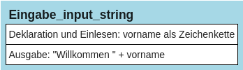

# Ein- und Ausgabe von Zeichenketten


Bisher haben wir in unseren Programmen Daten an die Benutzer ausgegeben,
haben aber noch keine Daten durch die Benutzer eingeben lassen. Das ist
aber eine sehr häufig benötigte Funktion. Diese soll daher nun in unsere
Programme integriert werden.

Für die Benutzereingabe sind in der Regel zwei Elemente nötig: Man
benötigt eine Nachricht an die Benutzer, dass nun etwas eingegeben
werden soll und außerdem muss die Benutzereingabe in einer Variablen
abgespeichert werden, damit die eingegebenen Daten im Programm später
weiterberarbeitet werden können.

In Python wird dafür die Funktion *input()* verwendet. Diese Funktion
gibt eine Nachricht auf dem Bildschirm aus und wartet dann auf
Tastatureingaben, die mit der Taste „Enter“ abgeschlossen werden. Die
eingegebenen Zeichen werden dann als Text in einer Variablen
abgespeichert. Das folgende Beispiel macht die Funktionsweise deutlich:

``` python
#Beispiel:
vorname = input("Bitte Vornamen eingeben: ")
print("Willkommen", vorname)
```

### Erklärung:

> Mit der Anweisung input wird der Text „Bitte Vornamen eingeben: “ auf
> dem Bildschirm ausgegeben. Die Benutzer des Programms haben dann
> Gelegenheit, Daten mittels Tastatur einzugeben und die Eingabe mit
> Taste „Enter“ abzuschließen. Sobald das geschieht, werden die
> eingegebenen Daten in der Variablen vorname abgespeichert, so dass sie
> in der anschließenden Ausgabe verwendet werden können.

## Struktogramm:

<figure>

<figcaption aria-hidden="true">image.png</figcaption>
</figure>

## Aufgabe:

Erweitern Sie das Beispielprogramm so, dass es zusätzlich nach dem
Nachnamen fragt und anschließend die Meldung „Willkommen vorname
nachname“ ausgibt:

``` python
#Hier den Programmcode eingeben und mit STRG+ENTER ausführen
```
