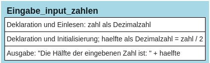

# Eingabe von Zahlen mit *input()*


Die Funktion *input()* hat eine auf den ersten Blick überraschende
Eigenschaft: Sie interpretiert alle eingegebenen Zahlen als Zeichen,
d.h. auch Ziffern werden als Zeichen und nicht als Zahlen betrachtet.
Das wird im folgenden Programm deutlich:

``` python
#Beispiel
zahl = input("Bitte geben Sie eine Zahl ein: ")
haelfte = zahl / 2
print("Die Hälfte der eingegebenen Zahl ist: ", haelfte)
```

    Bitte geben Sie eine Zahl ein:  10

    TypeError: unsupported operand type(s) for /: 'str' and 'int'

Hier wird ausgesagt, dass die Operation „/“, also die Division, mit den
Datentypen „str“ (= String, Zeichenkette) und „int“ (= Ganzzahl) nicht
durchgeführt werden kann, was ja auch stimmt – Es macht ja auch keinen
Sinn, eine Zeichenkette durch die Zahl 2 zu teilen!

Lösung: Da Python Werte der Funktion *input()* immer als Text („String“)
interpretiert, muss man die eingegebenen Zeichen beim Abspeichern in der
Variablen mittels der Funktion *float()* in eine Dezimalzahl umwandeln:

    zahl_zeichenkette = input("Bitte geben Sie eine Zahl ein: ")
    zahl_dezimalzahl = float(zahl_zeichenkette)

Alternativ kann die Zeile

    zahl = input("Bitte geben Sie eine Zahl ein: ")

erweitert werden zu:

    zahl = float(input("Bitte geben Sie eine Zahl ein: "))

Das korrigierte und funktionierende Programm sieht jetzt so aus:

``` python
zahl = float(input("Bitte geben Sie eine Zahl ein: "))
haelfte = zahl / 2
print("Die Hälfte der eingegebenen Zahl ist:", haelfte)
```

    Bitte geben Sie eine Zahl ein:  10

    Die Hälfte der eingegebenen Zahl ist: 5.0

## Struktogramm:

<figure>

<figcaption aria-hidden="true">image.png</figcaption>
</figure>

## Wichtiger Hinweis:

Soll eine Ganzzahl eingegeben werden, muss die Funktion *int()* benutzt
werden, also z.B.:

    anzahlAutos = int(input("Anzahl Autos: "))
