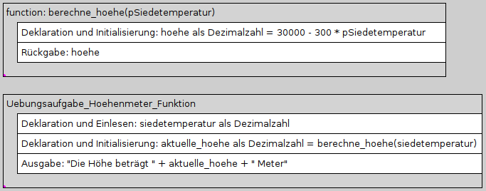
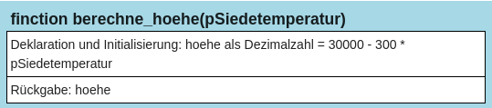
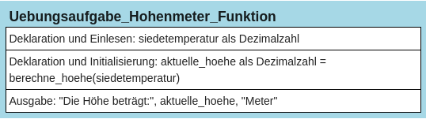

# Aufgabe: Berechnung der Höhenmeter mit einer Funktion


Sie haben in der früheren Aufgabe schon ein Programm geschrieben,
welches mit Hilfe der Siedetemperatur von Wasser die aktuelle Höhe
berechnen kann. Das Programm hat folgenden Aufbau:

    print("Programm zur Berechnung der Höhe anhand der Siedetemperatur")
    siedetemperatur = float(input("Siedetemperatur in Grad Celsius: "))
    hoehe = 30000 - 300 * siedetemperatur
    print("Die Höhe beträgt:", hoehe,"Meter")

Ändern Sie das Programm so ab, dass für die Berechnung der Höhe eine
Funktion *berechne_hoehe()* benutzt wird. Diese empfängt als Parameter
die Siedetemperatur, berechnet daraus die Höhe und gibt diese Höhe als
Rückgabewert zurück. Im Hauptprogramm soll der Benutzer zur Eingabe der
Siedetemperatur aufgefordert werden, danach die Funktion
*berechne_hoehe()* aufgerufen werden und ihr Rückgabewert in einer
Variablen *hoehe* abgespeichert werden. Abschließend soll die errechnete
Höhe mit einem kleinen Erläuterungstext ausgegeben werden.

### Struktogramm:

Zeichnen Sie ein Struktogramm zu diesem Programm.

<figure>

<figcaption aria-hidden="true">image.png</figcaption>
</figure>

<figure>

<figcaption aria-hidden="true">image.png</figcaption>
</figure>

<figure>

<figcaption aria-hidden="true">image.png</figcaption>
</figure>

### Programmcode (Python-Code)

``` python
#Hier den Programmcode eingeben und mit STRG+ENTER ausführen
def berechne_hoehe(pSiedetemperatur):
    hoehe = 30000 - 300 * pSiedetemperatur
    return hoehe

siedetemperatur = float(input("Siedetemperatur in Grad Celsius: "))
aktuelle_hoehe = berechne_hoehe(siedetemperatur)
print("Die Höhe beträgt:", aktuelle_hoehe, "Meter")
```
