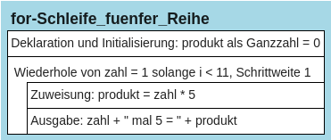

# Die for-Schleife (Zählerschleife)


## Einfache Listen erstellen

In Python kann mit der Anweisung *range(endwert)* eine Liste mit
Zahlenwerten angelegt werden. Dabei wird eine Liste erzeugt, die bei 0
beginnt und bis zur letzten Zahl vor endwert reicht, also von *0* bis
*endwert-1*. Die im folgenden Beispiel mit *range(10)* erzeugte
Zahlenliste beginnt also mit *0* und geht bis *9*, nämlich *endwert-1*,
d.h. *10 - 1 = 9*:

``` python
zahlenliste = range(10)
# Ausgabe der Liste mit ihren Zahlenwerten:
print(list(zahlenliste))
```

    [0, 1, 2, 3, 4, 5, 6, 7, 8, 9]

## Listen mit einem eigenen Startwert erstellen

Man kann der Liste aber auch einen anderen Startwert als 0 geben, dazu
wird die Anweisung range(anfangswert, endwert) benutzt:

``` python
zahlenliste = range(3, 10)
# Ausgabe der Liste mit ihren Zahlenwerten:
print(list(zahlenliste))
```

    [3, 4, 5, 6, 7, 8, 9]

## Listen mit einer anderen Schrittweite erstellen

Möchte man zusätzlich eine andere Schrittweite verwenden, wird hierfür
die Anweisung *range(anfangswert, endwert, schrittweite)* benutzt:

``` python
zahlenliste = range(1, 16, 2)
# Ausgabe der Liste mit ihren Zahlenwerten:
print(list(zahlenliste))
```

    [1, 3, 5, 7, 9, 11, 13, 15]

## Aufgaben

    a) Erzeugen Sie eine Liste von 0 bis 15.
    b) Erzeugen Sie eine Liste von 8 bis 19.
    c) Erzeugen Sie eine Liste aller geraden Zahlen von 2 bis 20.
    d) Erzeugen Sie eine Liste in absteigender Reihenfolge von 10 bis 1.

``` python
# Aufgabe a

# Aufgabe b

# Aufgabe c

# Aufgabe d
```

## Die for-Schleife

In manchen Fällen muss ein Programm immer wieder die gleichen
Anweisungen hintereinander ausführen, bis ein bestimmtes Ergebnis
eintritt. Wenn der Programmierer schon vorher weiß, wie oft ein Programm
wiederholt werden muss, wird oft die for-Schleife benutzt. Das folgende
Programm gibt zeilenweise alle Zahlen von 0 bis 9 aus: Beispiel:

``` python
for zahl in range(10):
    print(zahl)
```

    0
    1
    2
    3
    4
    5
    6
    7
    8
    9

In Python besteht die for-Schleife aus drei Elementen:  
1. Dem Schlüsselwort „for“, mit dem die Schleife eingeleitet wird,  
2. einer Variablen (hier: *zahl*), die mit in der Reihe nach alle Werte
der folgenden Liste annimmt,  
3. einer Liste, in der die Werte stehen, die die angegebene Variable der
Reihe nach annimmt. Diese Liste kann mit *range(endwert)* angegeben
werden. Nach der Angabe der Liste folgt ein Doppelpunkt als Zeichen
dafür, dass hier der Inhalt der Schleife beginnt. In den folgenden
Zeilen stehen die Anweisungen, die im Rahmen der Schleife ausgeführt
werden sollen, wobei die Zeilen, die zur Schleife gehören, eingerückt
sein müssen. Dabei nimmt *zahl* der Reihe nach alle Werte in der Liste
an, d.h. im obigen Beispiel nimmt zahl im ersten Durchlauf den Wert 0
an, im zweiten Durchlauf den Wert 1, danach 2 und so weiter, bis zahl im
letzten Durchlauf den letzten Wert der Liste annimmt, also 9.

Anwendungsbeispiel: Es soll ein Programm geschrieben werden, das die
5er-Reihe von 5 bis 50 ausgibt:

``` python
produkt=0
for zahl in range(1, 11):
    produkt = zahl * 5
    print(zahl, "mal 5 =", produkt)
```

    1 mal 5 = 5
    2 mal 5 = 10
    3 mal 5 = 15
    4 mal 5 = 20
    5 mal 5 = 25
    6 mal 5 = 30
    7 mal 5 = 35
    8 mal 5 = 40
    9 mal 5 = 45
    10 mal 5 = 50

In diesem Programm nimmt die Variable zahl der Reihe nach die Werte von
1 bis 10 an. Bei jedem Schleifendurchlauf wird zahl mit 5 multipliziert
und anschließend auf dem Bildschirm ausgegeben, beim ersten Durchgang
also 1 mal 5, beim zweiten Durchgang 2 mal 5 etc., bis zum Schluss dann
10 mal 5 berechnet und ausgegeben wird.

# Struktogramm:

<figure>

<figcaption aria-hidden="true">image.png</figcaption>
</figure>
