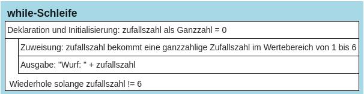
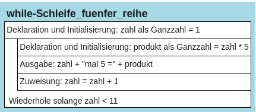

# While-Schleife


In manchen Fällen muss ein Programm immer wieder die gleichen
Anweisungen viele Male hintereinander ausführen, bis ein bestimmtes
Ergebnis eintritt. Wie oft man diese Anweisungen wiederholen muss, hängt
dabei von einer Bedingung ab, welche am Anfang, bevor die Anweisungen
ausgeführt werden, überprüft wird. Solche Wiederholungen nennt man auch
Schleifen. Ist die Anzahl der Schleifendurchläufe vor dem Beginn des
Programms nicht exakt bekannt, benutzt man eine **while-Schleife**.

Das folgende Programm simuliert einen Würfelvorgang und würfelt solange,
bis eine 6 gewürfelt wurde:

``` python
from random import *
zufallszahl = 0
while zufallszahl != 6:
    zufallszahl = randint(1, 6)
    print ("Wurf:", zufallszahl)
```

    Wurf: 4
    Wurf: 2
    Wurf: 2
    Wurf: 6

> **Hinweis:** In diesem Programm kommen zwei Anweisungen vor, die
> benötigt werden, weil mit Zufallszahlen gearbeitet werden soll: In
> Zeile 1 wird ein Modul in das Programm eingebunden, das
> Zufallszahlenfunktionalität zur Verfügung stellt, in Zeile 4 wird dann
> eine Funktion des Moduls genutzt, die Funktion randint(1, 6), die eine
> ganzzahlige Zufallszahl aus dem Bereich 1 bis 6 erzeugt.

## Erklärung des Programmablaufs:

In Zeile 2 erhält die Variable zufallszahl den Wert 0. Dann wird in
einer while-Schleife der Variablen zufallszahl solange ein Zufallswert
im Wertebereich von 1 bis 6 zugewiesen, bis zufallszahl=6 ist. Bei jedem
Durchlauf wird der jeweilige Wert von zufallszahl ausgegeben. \## Aufbau
der while-Schleife in Python: Eine while-Schleife wird in Python mit dem
Schlüsselwort **while** eingeleitet. Danach folgt die Bedingung, die
erfüllt sein muss, damit die Schleife wiederholt wird, d.h. die Schleife
wird wiederholt, solange die Bedingung erfüllt ist (hier im Beispiel:
solange zufallszahl ungleich 6 ist). Abschließend folgt ein Doppelpunkt,
und unter dem Doppelpunkt stehen eingerückt alle Anweisungen, die im
Rahmen der Schleife ausgeführt werden sollen.

# Struktogramm:

<figure>

<figcaption aria-hidden="true">image.png</figcaption>
</figure>

Andererseits lässt sich jede for-Schleife auch in eine while-Schleife
übertragen. Wir vergleichen das Beispiel der for-Schleife aus der
letzten Einheit mit der Umsetzung als while-Schleife.
Anwendungsbeispiel: Es soll ein Programm geschrieben werden, das die
5er-Reihe von 5 bis 50 ausgibt:

``` python
# Variante 1 (FOR-Schleife)
for zahl in range(1, 11):
    produkt = zahl * 5
    print(zahl, "mal 5 =", produkt)
```

    1 mal 5 = 5
    2 mal 5 = 10
    3 mal 5 = 15
    4 mal 5 = 20
    5 mal 5 = 25
    6 mal 5 = 30
    7 mal 5 = 35
    8 mal 5 = 40
    9 mal 5 = 45
    10 mal 5 = 50

``` python
# Variante 2 (WHILE-Schleife)
zahl = 1
while zahl < 11:
   produkt = zahl * 5
   print(zahl, "mal 5 =", produkt)
   zahl = zahl + 1
```

    1 mal 5 = 5
    2 mal 5 = 10
    3 mal 5 = 15
    4 mal 5 = 20
    5 mal 5 = 25
    6 mal 5 = 30
    7 mal 5 = 35
    8 mal 5 = 40
    9 mal 5 = 45
    10 mal 5 = 50

Im Vergleich ist ein wesentlicher Unterschied festzustellen:  
In der for-Schleife greifen wir auf eine festgelegte Zahlenliste zurück.
Diese nutzen wir bei der while-Schleife nicht. Daher muss dort der
Zähler zunächst deklariert und initialisiert werden. Ebenso muss in der
while-Schleife der Zähler manuell verändert werden.

<figure>

<figcaption aria-hidden="true">image.png</figcaption>
</figure>
