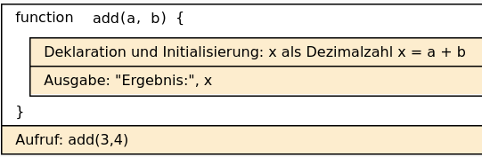
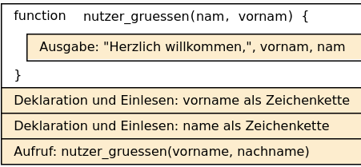

# Funktionen mit Parameter


Einem Unterprogramm können Werte beim Aufruf übergeben werden.  
Bei der Definition des Unterprogramms gibt man die Werte zwischen den
runden Klammern nach dem Namen an.

``` python
def add(a,b):
    x=a+b
    print("Ergebnis:", x)
```

``` python
add(3,4)
```

    Ergebnis: 7

## Struktogramm

<figure>

<figcaption aria-hidden="true">image.png</figcaption>
</figure>

Folgende Befehle erzeugen einen Fehler. Warum?

``` python
add()
```

    TypeError: add() missing 2 required positional arguments: 'a' and 'b'

``` python
add(3)
```

    TypeError: add() missing 1 required positional argument: 'b'

## Beispiel:

``` python
# Beispiel:
def nutzer_gruessen(nam, vornam):
    print("Herzlich willkommen,", vornam, nam)

vorname = input("Bitte Vornamen eingeben: ")
nachname = input("Bitte Nachname eingeben: ")
nutzer_gruessen(vorname, nachname)
```

    Herzlich willkommen, Max Mustermann

### Struktogramm:

<figure>

<figcaption aria-hidden="true">image.png</figcaption>
</figure>
