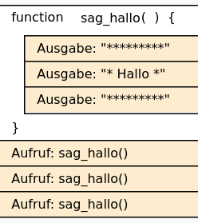

# Funktionen ohne Parameter


Eine Funktion ist ein ausgelagertes Unterprogramm, das beliebig oft im
Hauptprogramm aufgerufen werden kann. Dadurch wird das ganze Programm
übersichtlicher und einfacher zu entwickeln. Bestimmte Vorgänge, die
immer wieder benötigt werden, können so ausgelagert werden und von jeder
beliebigen Programmstelle aus immer wieder aufgerufen werden, anstatt
sie jedes Mal neu zu erstellen.

``` python
# Beispiel:
# Hier ist die Funktion:
def sag_hallo():
    print("*********");
    print("* Hallo *");
    print("*********");
# Hier beginnt das Hauptprogramm:
sag_hallo()
sag_hallo()
sag_hallo()
```

    *********
    * Hallo *
    *********
    *********
    * Hallo *
    *********
    *********
    * Hallo *
    *********

## Struktogramm

<figure>

<figcaption aria-hidden="true">image.png</figcaption>
</figure>

Die Definition der Funktion beginnt mit dem Schlüsselwort *def*. Danach
folgt der Name der Funktion. (Für die Namensgebung gelten die gleichen
Regeln wie für Variablen.) Anschließend folgen runde Klammern, in denen
sogenannte Funktionsparameter stehen können. Da hier im Beispiel keine
Funktionsparameter übergeben werden, bleiben die Klammern leer. (In den
folgenden Beispielen ändert sich das dann.) Hinter den Klammern folgt
ein Doppelpunkt, um anzuzeigen, dass danach die Anweisungen folgen, mit
denen die Funktion die Aufgaben durchführt, für die sie geschrieben
wird. Im Beispiel hier ist das nur eine Anweisung:
`print("Hallo miteinander!")`. \## Wichtig: \>Die zur Funktion gehörigen
Anweisungen müssen auf einer Ebene eingerückt sein. Im Hauptteil des
Programms wird die Funktion hallo() dreimal aufgerufen. Der Aufruf
besteht aus dem Namen der Funktion, gefolgt von den runden Klammern. Bei
jedem Aufruf springt das Programm zur Funktion und führt sie aus. Nach
der Ausführung der Funktion springt das Programm wieder zur Aufrufstelle
zurück und führt die Anweisung aus, die auf den Funktionsaufruf folgt.
Auf diese Weise wird im vorliegenden Beispiel dreimal die Funktion
hallo() aufgerufen und gibt dabei jedes Mal den Text “Hallo
miteinander!” aus
