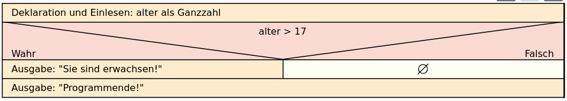
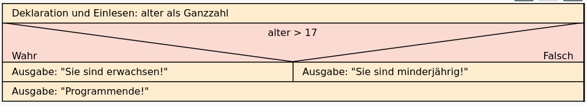

# Die einseitige if-Anweisung / Verzweigung


Bisher haben wir Programme, die mit der ersten Anweisung starten, dann
mit der zweiten Anweisung weitermachen usw. bis die letzte Anweisung
ausgeführt wird. Das Programm läuft sozusagen gerade durch, ohne andere
Alternativen zu berücksichtigen. Mit einer bedingten Anweisung kann man
Alternativen berücksichtigen. Dies wird in Python mit einer if-Anweisung
realisiert. Das untere Beispiel zeigt eine einseitige Verzweigung.

``` python
alter = int(input("Bitte geben Sie Ihr Alter in Jahren an: "))
if alter > 17:
    print("Sie sind erwachsen!")
print("Programmende!")
```

    Bitte geben Sie Ihr Alter in Jahren an:  17

    Programmende!

Eine Variable alter wird deklariert und über die Benutzereingabe
initialisiert. Nun wird mit der if-Anweisung eine Bedingung (alter \>
17) überprüft. Diese Bedingung steht nach der if-Anweisung. Das, was das
Programm machen soll, falls die Bedingung erfüllt ist, steht in dem
dazugehörigen Block. Dieser Block wird in Python gebildet, indem nach
der Bedingung ein Doppelpunkt kommt, der den Block einleitet (vgl. Zeile
2), und dann alle zum if-Block gehörigen Anweisungen eingerückt werden
(vgl. Zeile 3). Ist der Block beendet, wird die Einrückung der
Anweisungen beendet (vgl. Zeile 4). In diesem Programm wird also in
jedem Fall der Text „Programmende!“ ausgegeben, und vorher der Text „Sie
sind erwachsen!“, falls die Variable alter einen Wert enthält, der
größer ist als 17.

<figure>

<figcaption aria-hidden="true">grafik.png</figcaption>
</figure>

# Vergleichsoperatoren

Vergleichsoperatoren werden immer zum Vergleich zweier Werte benutzt und
finden ihre Anwendung zumeist beim Einsatz von Wiederholungen oder
Alternativen. Als Ergebnis des Vergleichs wird ein boolescher Wert (True
/ False) zurückgegeben. Meist werden eine Variable mit einem festen Wert
oder eine Variable mit einer anderen Variablen verglichen. Je nach
Ergebnis des Vergleichs wird das Programm eine andere Reaktion zeigen.

Hinweis: In Python werden auch Textvergleiche mit dem Operator “==”
durchgeführt.

<table>
<thead>
<tr class="header">
<th>Operator</th>
<th>Beispiel</th>
<th>Beschreibung</th>
</tr>
</thead>
<tbody>
<tr class="odd">
<td>&lt;</td>
<td>a &lt; b</td>
<td>a ist kleiner als b</td>
</tr>
<tr class="even">
<td>&lt;=</td>
<td>a &lt;= b</td>
<td>a ist kleiner oder gleich b</td>
</tr>
<tr class="odd">
<td>&gt;</td>
<td>a &gt; b</td>
<td>a ist größer als b</td>
</tr>
<tr class="even">
<td>&gt;=</td>
<td>a &gt;= b</td>
<td>a ist größer oder gleich b</td>
</tr>
<tr class="odd">
<td>==</td>
<td>a == b</td>
<td>a ist gleich b</td>
</tr>
<tr class="even">
<td>!=</td>
<td>a != b</td>
<td>a ist ungleich b</td>
</tr>
</tbody>
</table>

# Die zweiseitige if-Anweisung / Verzweigung

Bei der einseitigen if-Anweisung wird nur der True-Zweig berücksichtigt.
Es werden dann nur Anweisungen ausgeführt, wenn die Bedingung wahr ist.
Im folgenden Beispiel gibt es auch eine Anweisung, wenn die Bedingung
falsch ist.

``` python
alter = int(input("Bitte geben Sie Ihr Alter in Jahren an: "))
if alter > 17:
    print("Sie sind erwachsen!")
else:
    print("Sie sind minderjährig!")
print("Programmende!")
```

    Bitte geben Sie Ihr Alter in Jahren an:  17

    Sie sind minderjährig!
    Programmende!

<figure>

<figcaption aria-hidden="true">grafik.png</figcaption>
</figure>

Die if-Anweisung wird mit else erweitert. Nach dem True-Block wird der
False-Block mit dem Schlüsselwort else eingeleitet. Beachten Sie auch
hier den Doppelpunkt nach dem Schlüsselwort else sowie die darauf
folgende Einrückung der Anweisungen, die zum else-Block gehören. Testen
Sie das Programm und variieren Sie es, bis Sie den Aufbau der Blöcke gut
vor Augen haben.
