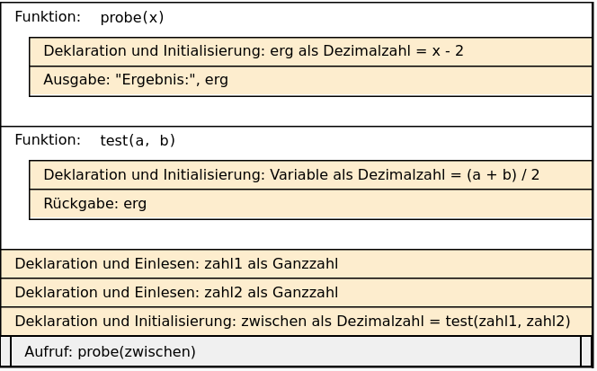

# Klassenarbeit 2: Einführung in Programmierung mit python


Ihr Name:

## Aufgabe 1: Struktogramm erstellen \[4 P\]

Erstellen Sie ein Struktogramm zu dem folgenden Python-Code

``` python
zahl_x = 4
zahl_y = 2
ergebnis = 100
counter = 1
for i in range(5,10):
    ergebnis = zahl_x + zahl_y ** i
    print("Ergebnis Nr.", counter ,'-',  ergebnis)
    counter = counter + 1
```

Hier soll das Struktogramm als Screenshot eingefügt werden

Korrekturfeld, bitte nicht ändern.

## Aufgabe 2: Struktogramm übersetzen \[6 P\]

Übersetzen Sie das folgende Struktogramm in Python.

<figure>

<figcaption aria-hidden="true">grafik.png</figcaption>
</figure>

``` python
# Ihre Lösung bitte hier eintragen
```

Korrekturfeld, bitte nicht ändern.

## Aufgabe 3: Notenberechnung \[4 P\]

Erstellen Sie ein Python-Programm, das den Benutzer nach den Noten für
drei Fächer fragt und den Durchschnitt berechnet.

Geben Sie eine Nachricht aus, die den Durchschnitt anzeigt und eine
Bewertung basierend auf dem Durchschnitt abgibt.  
Wenn der Durchschnitt kleiner als 4.0 ist, kommt eine Textmeldung “Sie
haben bestanden!”, sonst “Leider nicht bestanden. Viel Erfolg beim
nächsten Mal!”

Erwartete Ausgabe:

    Geben Sie die Note für Fach 1 ein:  2.5
    Geben Sie die Note für Fach 2 ein:  3.0
    Geben Sie die Note für Fach 3 ein:  4.0

    Der Durchschnitt ist: 3.1666666666666665
    Sie haben bestanden!

``` python
# Ihre Lösung bitte hier eintragen
```

Korrekturfeld, bitte nicht ändern.

## Aufgabe 4: Snack-Bestellung \[6 P\]

Vervollständigen Sie den unten stehenden Code, um den Gesamtpreis für
eine Snack-Bestellung zu berechnen und eine Rechnung auszugeben. Der
Preis für einen Snack beträgt 3 Euro.

Erwartete Ausgabe:

    Geben Sie Ihren Namen ein:  Steffi
    Wie viele Snacks möchten Sie bestellen?  12

    ------------------------------
    Snack-Rechnung für Steffi
    ------------------------------
    Zu zahlender Betrag: 36 €

``` python
def berechne_betrag(preis, menge):
    # Hier fehlt was

def erstelle_rechnung(zahlungsbetrag, name):
    # Hier fehlt was

name = input("Geben Sie Ihren Namen ein: ")
anzahl_snacks = int(input("Wie viele Snacks möchten Sie bestellen? "))
# Hier fehlt was
```

Korrekturfeld, bitte nicht ändern.

## Aufgabe 5: Volumen eines Kegels \[4 P\]

Entwickeln Sie ein Python-Programm, das das Volumen (V) eines Kegels
berechnet. Fragen Sie den Benutzer nach dem Radius (r) und der Höhe (h)
des Kegels in cm und verwenden Sie die Formel:
*V* = 1/3 *π* *r*<sup>2</sup> *h*

Überprüfen Sie, ob die Eingaben positiv sind, sonst erscheint die
Textmeldung “Falsche Eingabe. Der Radius und die Höhe müssen positiv
sein.”  
Die Zahl *π* können sie durch 3.14 ersetzen.

Erwartete Ausgabe:

    Geben Sie den Radius des Kegels ein:  3
    Geben Sie die Höhe des Kegels ein:  4

    Das Volumen des Kegels beträgt: 37.68

``` python
# Ihre Lösung bitte hier eintragen
```

Korrekturfeld, bitte nicht ändern.

## Aufgabe 6: Berechnungstabelle für Quadratzahlen \[6 P\]

Entwickeln Sie ein Programm, das eine Berechnungstabelle für die
Quadratzahlen der ersten n natürlichen Zahlen erstellt. Der Benutzer
gibt n ein, und das Programm gibt eine Tabelle mit den Zahlen und ihren
Quadraten aus.

Erwartete Ausgabe:

    Geben Sie eine positive ganze Zahl ein:  7

    -----------------
    Zahl    Quadrat
    -----------------
    1    1
    2    4
    3    9
    4    16
    5    25
    6    36
    7    49

``` python
# Ihre Lösung bitte hier eintragen
```

Korrekturfeld, bitte nicht ändern.
