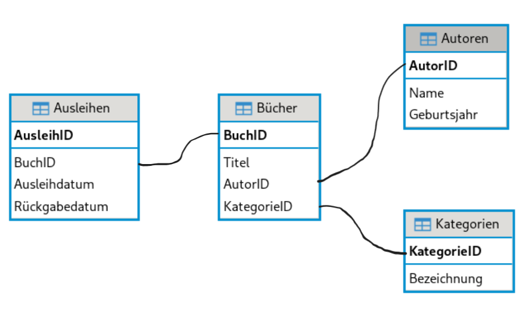

# Vorbereitung auf die KA-1


``` python
 %load_ext sql
 %sql  sqlite:///buecherei.db
```

Gegeben ist folgendes Entity-Relationship-Modell (ERM) zu der
Stadtbücherei-Datenbank.

<figure>

<figcaption aria-hidden="true">image.png</figcaption>
</figure>

Die Datenbankdatei kann man [hier](buecherei.db) downloaden.

## SQL-Abfragen

### 1. Gebe die Liste aller Autoren aus

``` python
%%sql
SELECT * FROM Autoren;
```

### 2. Finde alle Bücher, die im Jahr 2024 ausgeliehen wurden

``` python
%%sql
SELECT Titel, Ausleihdatum FROM Bücher, Ausleihen WHERE Bücher.BuchID = Ausleihen.BuchID AND Ausleihdatum LIKE '2024%';
```

### 3. Zeige alle Kategorien, die mit ‘Fiktion’ beginnen

``` python
%%sql
SELECT * FROM Kategorien WHERE Bezeichnung LIKE 'Fiktion%';
```

### 4. Liste der Bücher, sortiert nach Titel in aufsteigender Reihenfolge

``` python
%%sql
SELECT * FROM Bücher ORDER BY Titel ASC;
```

### 5. Finde alle Autoren, die nach 1980 geboren wurden

``` python
%%sql
SELECT * FROM Autoren WHERE Geburtsjahr > 1980;
```

### 6. Liste der Bücher mit den entsprechenden Autoren

``` python
%%sql
SELECT Bücher.Titel, Autoren.Name 
FROM Bücher, Autoren 
WHERE Bücher.AutorID = Autoren.AutorID;
```

### 7. Finde alle Bücher in der Kategorie ‘Fantasy’

``` python
%%sql
SELECT Bücher.Titel, Kategorien.Bezeichnung
FROM Bücher, Kategorien 
WHERE Bücher.KategorieID = Kategorien.KategorieID 
AND Kategorien.Bezeichnung = 'Fantasy';
```

### 8. Liste der Ausleihen mit Buchtiteln und Ausleihdatum

``` python
%%sql
SELECT Bücher.Titel, Ausleihen.Ausleihdatum 
FROM Ausleihen, Bücher 
WHERE Ausleihen.BuchID = Bücher.BuchID;
```

### 9. Finde alle Bücher, die von ‘Max Mustermann’ geschrieben wurden

``` python
%%sql
SELECT Bücher.Titel 
FROM Bücher, Autoren 
WHERE Bücher.AutorID = Autoren.AutorID 
AND Autoren.Name = 'Max Mustermann';
```

### 10. Finde alle Ausleihen mit Buchtiteln, Autoren und Ausleihdatum

``` python
%%sql
SELECT Bücher.Titel, Autoren.Name, Ausleihen.Ausleihdatum 
FROM Ausleihen, Bücher, Autoren 
WHERE Ausleihen.BuchID = Bücher.BuchID 
AND Bücher.AutorID = Autoren.AutorID;

```

### 11. Liste der Bücher mit ihren Kategorien und Autoren

``` python
%%sql
SELECT Bücher.Titel, Kategorien.Bezeichnung, Autoren.Name 
FROM Bücher, Kategorien, Autoren 
WHERE Bücher.KategorieID = Kategorien.KategorieID 
AND Bücher.AutorID = Autoren.AutorID;
```

### 12. Finde alle Bücher, die in der Kategorie ‘Kinderbuch’ sind und von ‘Lisa Koch’ geschrieben wurden

``` python
%%sql
SELECT Bücher.Titel, Kategorien.Bezeichnung, Autoren.Name
FROM Bücher, Kategorien, Autoren 
WHERE Bücher.KategorieID = Kategorien.KategorieID 
AND Bücher.AutorID = Autoren.AutorID
AND Autoren.Name = 'Lisa Koch'
AND Kategorien.Bezeichnung = 'Kinderbuch'
```

### 13. Finde alle Ausleihen von Büchern, die nach dem 1. März 2024 ausgeliehen wurden

``` python
%%sql
SELECT Bücher.Titel, Ausleihen.Ausleihdatum 
FROM Ausleihen, Bücher 
WHERE Ausleihen.BuchID = Bücher.BuchID 
AND Ausleihen.Ausleihdatum > '2024-03-01';
```

### 14. Liste der Bücher, die im März 2024 ausgeliehen wurden

``` python
%%sql
SELECT Bücher.Titel, Ausleihen.Ausleihdatum
FROM Ausleihen, Bücher 
WHERE Ausleihen.BuchID = Bücher.BuchID 
AND Ausleihen.Ausleihdatum LIKE '2024-03%';
```

### 15. Finde alle Autoren, deren Namen mit ‘T’ beginnen

``` python
%%sql
SELECT * FROM Autoren WHERE Name LIKE 'T%';
```

### 16. Liste der Bücher, die von Autoren geschrieben wurden, die nach 1990 geboren wurden

``` python
%%sql
SELECT Bücher.Titel 
FROM Bücher, Autoren 
WHERE Bücher.AutorID = Autoren.AutorID 
AND Autoren.Geburtsjahr > 1990;
```

## Datenbank erweitern

Die bestehende Datenbank für die Bibliothek umfasst die Tabellen
Autoren, Kategorien, Bücher und Ausleihen. Um die Funktionalität der
Datenbank zu erweitern, soll eine neue Tabelle namens **Ausleihstelle**
hinzugefügt werden. Diese Tabelle soll Informationen über die
verschiedenen Ausleihstellen in der Bibliothek enthalten, an denen die
Bücher ausgeliehen werden können.

Die neue Tabelle Ausleihestelle soll folgende Spalten enthalten:

-   AuleihestelleID: Eindeutige Identifikation der Ausleihstelle.
-   Name: Name der Ausleihstelle (z.B. “Zentrale Bibliothek”, “Filiale
    Nord”).
-   Standort: Standort der Ausleihstelle (z.B. “Hauptstraße 1, 12345
    Stadt”).
-   Telefonnummer: Kontakttelefonnummer der Ausleihstelle.

### Aufgabenstellung

Zeichnen Sie das erweiterte Entity-Relationship-Modell (ERM), das die
neue Tabelle Ausleihestelle integriert. Stellen Sie sicher, dass die
Beziehungen zwischen der neuen Tabelle und den bestehenden Tabellen klar
dargestellt sind.

Beziehungen: Definieren Sie die Beziehungen zwischen der Tabelle
Ausleihestelle und den bestehenden Tabellen. Überlegen Sie, wie die
Ausleihstellen mit den Ausleihen verknüpft werden können.

[Lösung](Vorbereitung-KA1_files/figure-html/cell-38-1-image.png)
