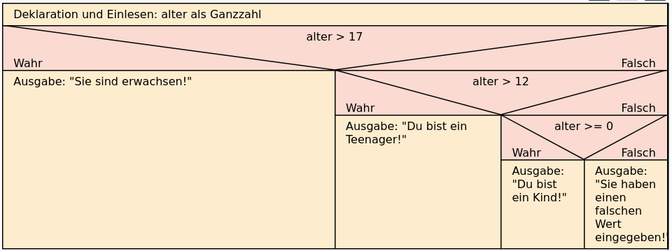

# Die geschachtelte if-Anweisung / Verzweigung


Bei der zweiseitigen if-Anweisung gibt es zwei Alternativen bzw.
Abzweigungen. Das folgende Beispiel zeigt eine Möglichkeit, wie man mehr
als zwei Alternativen realisieren kann.

``` python
alter = int(input("Bitte geben Sie Ihr Alter in Jahren an: "))
if alter > 17:
    print("Sie sind erwachsen!")
else:
    if alter > 12:
         print("Du bist ein Teenager!")
    else:
        if alter >= 0:
            print("Du bist ein Kind!")
        else:
            print("Sie haben einen falschen Wert eingegeben!")
```

    Bitte geben Sie Ihr Alter in Jahren an:  -45

    Sie haben einen falschen Wert eingegeben!

Im else-Block der ersten Bedingung wird in Zeile 5 eine zweite Bedingung
mit dem Schlüsselwort if eingebaut (daher „geschachtelte if-Anweisung“).
Im else-Block der zweiten Bedingung wird dann wiederum in Zeile 8 eine
dritte Bedingung mit if eingegeben. Sind alle drei geprüften Bedingungen
falsch, kann nur die Eingabe falsch sein (negativer Wert) und es kommt
daher zu einer Fehlermeldung.

<figure>

<figcaption aria-hidden="true">grafik.png</figcaption>
</figure>
