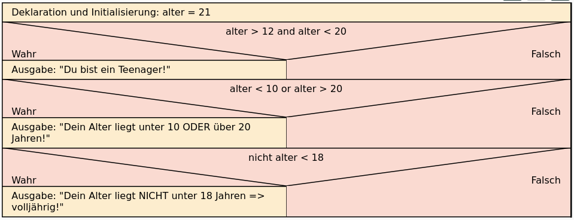

# Verknüpfte Bedingungen (logische Operatoren)


Wenn mehrere Bedingungen miteinander verknüpft werden, dann kann man die
logischen Operatoren **AND** für das logische und bzw. **OR** für das
logische Oder nutzen. Beim logischen Und müssen alle Teilbedingungen
wahr sein, damit die gesamte Bedingung wahr ist. Beim logischen Oder
reicht es, wenn mindestens eine Teilbedingung wahr ist, damit die
gesamte Bedingung wahr ist. Zusätzlich gibt es den logischen Operator
**NOT** für das logische Nicht. Die Wahrheitswerte einer Bedingung
werden dann umgedreht. *False* wird zu *True* und *True* wird zu
*False*.

``` python
alter = 21
if alter > 12 and alter < 20:
     print("Du bist ein Teenager!")
if alter < 10 or alter > 20:
     print("Dein Alter liegt unter 10 ODER über 20 Jahren!")
if not alter < 18:
     print("Dein Alter liegt NICHT unter 18 Jahren => volljährig!")
```

    Dein Alter liegt unter 10 ODER über 20 Jahren!
    Dein Alter liegt NICHT unter 18 Jahren => volljährig!

Zeile 1: Die Variable alter wird deklariert und erhält den Wert 21.  
Zeile 2: Hier wird geprüft, ob alter größer 12 UND kleiner 20 ist. Falls
das der Fall ist, kommt die dazu passende Ausgabe.  
Zeile 4: Hier wird geprüft, ob alter kleiner zehn ODER größer 20 ist.
Falls das der Fall ist, kommt die dazu passende Ausgabe.  
Zeile 6: Hier wird festgestellt, ob alter NICHT kleiner 18 ist. Falls
diese Aussage erfüllt ist, kommt die dazu passende Ausgabe.

<figure>

<figcaption aria-hidden="true">image.png</figcaption>
</figure>

## Denkaufgabe / Test yourself:

Was wird das Programm ausgeben, wenn die Variable alter zu Beginn des
Programms auf 17 gesetzt wird? Öffnen Sie das obige Programm und
überprüfen Sie, ob Ihre Vorhersage stimmt.

## Übersicht über die logischen Operatoren

Hier eine kurze Übersicht über die Verwendung von Operatoren in Python:

<table style="width:100%;">
<colgroup>
<col style="width: 14%" />
<col style="width: 28%" />
<col style="width: 28%" />
<col style="width: 28%" />
</colgroup>
<thead>
<tr class="header">
<th>Operator</th>
<th style="text-align: center;">Beispiel</th>
<th style="text-align: center;">Beschreibung</th>
<th style="text-align: left;">Erläuterung</th>
</tr>
</thead>
<tbody>
<tr class="odd">
<td>and</td>
<td style="text-align: center;">alter&gt;12 <strong>and</strong>
alter&lt;20</td>
<td style="text-align: center;">und</td>
<td style="text-align: left;">Die Bedingung ist erfüllt (True), wenn
beide Aussagen zutreffen.</td>
</tr>
<tr class="even">
<td>or</td>
<td style="text-align: center;">alter &lt;10 <strong>or</strong>
alter&gt;20</td>
<td style="text-align: center;">oder</td>
<td style="text-align: left;">Die Bedingung ist erfüllt (True), wenn die
eine <strong>oder</strong> die andere Aussage (oder beide) erfüllt
sind.</td>
</tr>
<tr class="odd">
<td>not</td>
<td style="text-align: center;"><strong>not</strong> alter&lt;18</td>
<td style="text-align: center;">nicht</td>
<td style="text-align: left;"><strong>not</strong> ändert einen Ausdruck
von True in False und umgekehrt. Hier ist die Bedingung erfüllt, wenn
das Alter nicht &lt; 18 ist.</td>
</tr>
</tbody>
</table>
